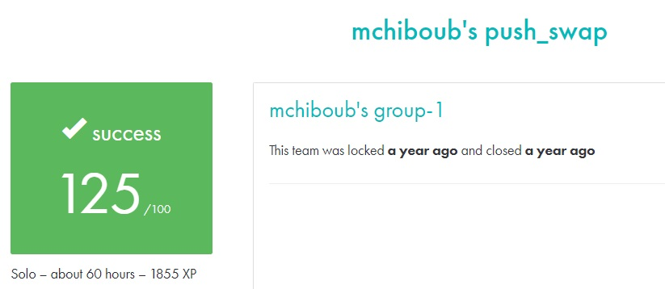

# PUSH_SWAP #

## What the project does: ##
The Push_swap project requires creating a program that sorts a stack of integers using a limited set of operations. The goal is to sort the numbers in the fewest moves possible by manipulating two stacks with predefined commands.

## Why the project is useful: ##
This project is useful because it introduces fundamental concepts of sorting algorithms and complexity. It helps you learn how to optimize solutions by choosing the most efficient algorithm for sorting, which is a key skill for technical interviews and problem-solving in software development.

[Subject of this project](en.subject.pdf)